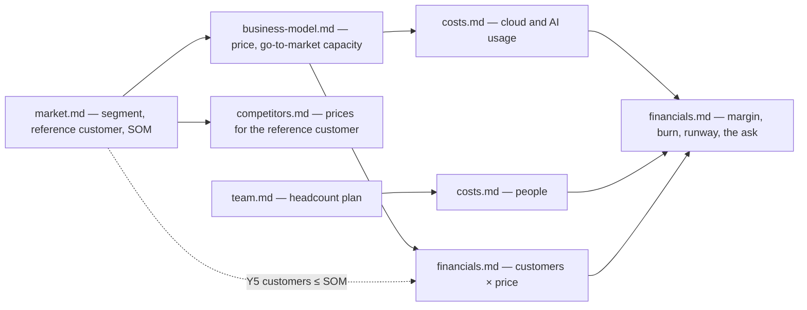

# The business plan

Who a business plan is written for, where it lives, which sections it carries, and what
every figure in it rests on.

The reader is an investor who knows venture funding and does not know this market. The plan
follows the conventions international venture investors read by — the sections Sequoia's
business-plan outline and Y Combinator's seed-deck guidance made standard — rather than a
bank's or a grant body's format, which asks for collateral and trading history a startup
does not have and buries the market and the team that a venture investor reads first.

## Files

The plan lives in `docs/business-plan/`, one file per section group below. Its `README.md`
opens with the company's purpose in one sentence — what it does, for whom — followed by the
plan's as-of date, its currency, and the index in the reading order of the table below.

The plan lives only in a repository whose access matches the plan's readers. A public
repository carries none of it: the costs, the price strategy and the fundraise are what a
competitor would most like to read.

## Sections

| File | Answers |
|---|---|
| `opportunity.md` | **Problem** — who has it, how they cope today, what coping costs them. **Solution** — what the customer gets and why it beats coping. **Why now** — what changed (a technology, a cost, a regulation, a habit) that makes this possible or needed now rather than five years ago |
| `market.md` | The segment and its size |
| `competitors.md` | The alternatives, their prices, and the comparison |
| `business-model.md` | **Business model** — who pays, for what, on which price metric, how often. **Go-to-market** — the channel that reaches the first customers, the sales cycle, and what one customer costs to acquire |
| `traction.md` | Evidence to date, dated and shown as a trend: revenue, active users, pilots, signed letters of intent. A company before launch shows the validation it has — interviews run, pilots agreed — and says it is before launch |
| `team.md` | Who builds it, and the roles still open |
| `costs.md` | Five years of running costs |
| `financials.md` | Revenue, unit economics, cash, the ask and its milestones |
| `risks.md` | The few risks that would end the company — market, technical, regulatory, key person, funding — and the milestone or test that retires each |

The five files with the most to get wrong have rules of their own in this folder:
[market](market.md), [competitors](competitors.md), [team](team.md), [costs](costs.md) and
[financials](financials.md).

The product section describes what the customer can do, at the altitude an investor reads.
Behaviour in detail belongs to `docs/specs/`, linked rather than restated.

## What a figure rests on

Every figure is one of three things, and its table says which:

- **A sourced fact** — linked to its source, with the date it was read. A figure from a
  report names the report, its publisher and its year.
- **An assumption** — the value and the reason for it: a comparable company, customer
  interviews, a quote received. Each sits in an assumptions table in the file that owns the
  subject, with an ID (`M3`, `C12`) that other files cite along with a link.
- **A derived figure** — the formula over cited rows, so a reviewer recomputes it without
  asking.

A number nobody can trace back is the first thing a diligence call finds.

All money is in one currency, named in the `README.md`. Costs incurred in another are
converted at a stated rate with its date, and where that exposure is material it appears in
`risks.md`. Years run as Y1 to Y5 from a stated start month rather than as calendar years, so
a plan that slips a quarter shifts its start month rather than every table.

## One set of numbers

The sections share their figures. A driver used twice is one assumption cited twice:

The consistency checks that follow from it: Y5 customers do not exceed the SOM; the
customers acquired each year do not exceed what the go-to-market capacity reaches; the
price the revenue uses is the price the competitor table compares; the usage that drives AI
and cloud cost is the usage the revenue charges for; the people cost counts exactly the
headcount plan.

## The deck and the spreadsheet

The markdown is the source. The pitch deck is built from it — around a dozen slides, one
idea each, with detail in an appendix — and every number on a slide traces to a row in the
plan. A spreadsheet an investor receives is exported from the plan's tables and is never
edited as the master, because two masters give two sets of numbers and the investor holds
both.

## Facts with a shelf life

Competitor prices, market reports, salary data and AI prices move. They are rechecked
before the plan goes to a new investor, and the as-of date moves only when they have been.

## Honest by construction

Findings that cut against the plan go in. A competitor that wins on a criterion customers
care about stays in the table; a risk with no mitigation is still listed. An investor finds
these anyway, and the plan that named them first is the one still believed afterwards.

The plan carries no individual compensation, no per-person equity split, and no name of a
candidate or investor who has not agreed to be named. Salaries appear as bands by role.
