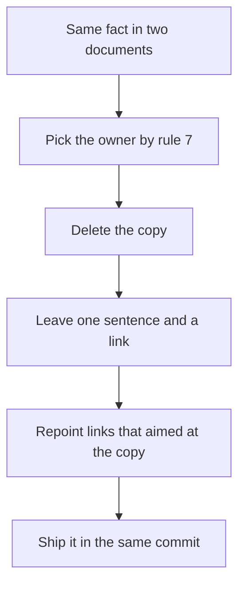

# Cross-referencing

Where a fact lives, and how every other document reaches it.

## Rules

### One home per fact

1. Every fact has exactly one owning document. A document needing a fact owned elsewhere
   **links to it** rather than restating it.
2. "Fact" means a definition, a rule, a procedure step, a configuration value, a schema, a
   limit, an endpoint contract, or the reasoning behind a decision.
3. A second document carries at most **one sentence** of orientation — enough for the reader
   to decide whether to follow the link — and that sentence is followed by the link.
   Anything longer is the link alone.

```markdown
Sessions steer toward a close once they have run long enough; see
[the wrap-up spec](../../specs/chat/chat-wrap-up.md) for the exact threshold.
```

4. A diagram is never copied into a second document. The second links to the document that
   owns it.
5. Code or configuration that already lives in the repository is linked, not pasted.
   Snippets existing only in the document — an example command, an illustrative shape — are
   fine within the [sizing limits](document-sizing.md).
6. Where two documents both genuinely need a fact to stand alone, the fact belongs in a
   third document that both link to.

### Which document owns what

| The fact is… | It lives in |
|---|---|
| A rule the project follows | `docs/constitutions/` |
| A decision, and why it beat the alternatives | `docs/adrs/` |
| How a feature behaves for the user | `docs/specs/` |
| How something is intended to be built | its ticket on the project board |
| A procedure a human runs step by step | the `guides/` section of the application or area it configures |
| The shape of the running system | the `architecture/` section of the application it belongs to |
| Evidence that a user-visible change was tested | `docs/test-reports/` |

The ticket row names no folder because there are no plan documents. How something is
intended to be built is written in the ticket that carries the work and closed by the pull
request that carries the change; a document restating it would outlive the branch that made
it true.

The architecture row names no single folder either, because the running system is not one
subject. Each application's `architecture/` describes that application as deployed, and
`docs/cloud/` describes the estate they all run on. [tree-shape.md](tree-shape.md) has the
sections an application folder carries.

The procedure row names none for the same reason: a runbook belongs to the thing it
configures, so the console runbooks sit under the console and the pipeline ones under
`devops/`.

7. Where a fact could sit in two of these, the owner is the document whose readers would be
   wrong without it. Every other document links.

### Removing a duplicate

Removing a duplicate is part of the change that found it, not a separate cleanup:



8. Updating a fact means updating its owner. Where the owner cannot be identified, that
   ambiguity is itself the bug, and it is resolved before the edit that prompted the visit.

### Link mechanics

9. Links between documents are relative and carry the `.md` extension
   (`../adrs/0005-host-docs-on-a-static-site.md`).
10. A link points at the file, not at a heading, unless the heading is stable. Docs-site
    builds do not validate anchors — a strict build reports a broken anchor as informational
    and passes anyway — so a renamed heading silently strands every link into it.
11. A strict build does fail on a relative link resolving outside the documentation root.
    Code, workflows, and anything else beyond the docs tree are linked by absolute URL.

## Rationale

Two copies of a fact do not stay two copies of the same fact. One gets updated, and from
then on the reader cannot tell which is true — a wrong document is more expensive than a
missing one. Linking is also what keeps rule 1 of [document-sizing.md](document-sizing.md)
affordable: a document stays under five minutes by pointing at context, not by absorbing it.
