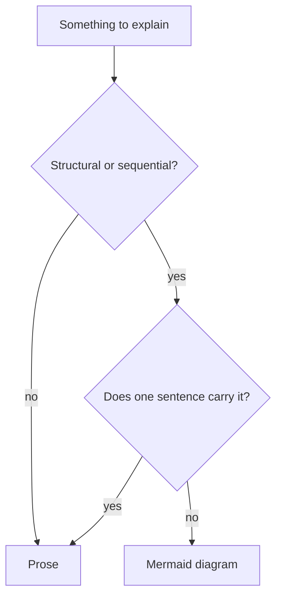

# Diagram style

How a diagram is written and checked, once [diagrams.md](diagrams.md) has settled that the
document needs one and which format it takes. The rule numbers here carry straight on from
that file's, because both get cited by number from source comments and from merged pull
requests.

## Rules

### Size and style

12. A diagram fits one screen: at most ~15 nodes, or ~8 participants in a sequence diagram.
    A larger one splits into several — and the document around it is probably over budget
    too. A `.drawio.svg` may run past that where the layout is the content, provided the
    docs site gives the reader a way to zoom it.
13. Direction is declared explicitly (`flowchart TD`, `flowchart LR`).
14. Every diagram carries `accTitle` and `accDescr` as its first two lines. The rendered SVG
    tells a screen reader nothing, and the description is what every reader gets on the day
    the block fails to render:

15. Every edge is labelled with what crosses it (`Bot -->|session report| Queue`), never with
    `1`, `2`, or a bare `yes`.
16. Node IDs are short and stable, with the human-readable text in the label. A label
    containing `()`, `:`, `,`, or `#` is quoted — an unquoted special character is a parse
    error, and a parse error replaces the **whole** diagram with an error box.
17. `style` and `classDef` are not used for decoration. A docs site with light and dark
    themes makes hardcoded colours unreadable in one of them. Colour carries meaning only
    where the caption states that meaning in words. A drawn diagram gets that restraint from
    adaptive colours.
18. Diagrams count toward the document's 650-line limit, and no single block exceeds 60
    lines — see [document-sizing.md](document-sizing.md).

### Verification

19. Docs-site builds do not validate Mermaid. A syntax error passes the build and appears
    only as an error box in the browser, so a new or edited diagram is previewed — on the
    pull request page or in a local site build — before merging.
20. A new or edited `.drawio.svg` is checked on a local site build in both themes, and
    reopened in draw.io to confirm the embedded copy survived. The build checks neither.

### What a drawn layout carries

21. Every element of one of the four layouts [diagrams.md](diagrams.md) rule 2 names has a
    named explanation in the document beside it. A box nobody explains is the unlabelled
    fact rule 10 already describes, and the four are exactly the diagrams dense enough to
    hide one in.
22. Rule 14 is a Mermaid mechanism, and a `.drawio.svg` has no second one. What it carries
    instead is the alt text on the markdown image, which [diagrams.md](diagrams.md) rule 4
    already requires.

## Rationale

Rules 16 and 19 exist because Mermaid fails loudly and totally: one bad character costs the
reader the entire diagram, and nothing in CI will tell you.
