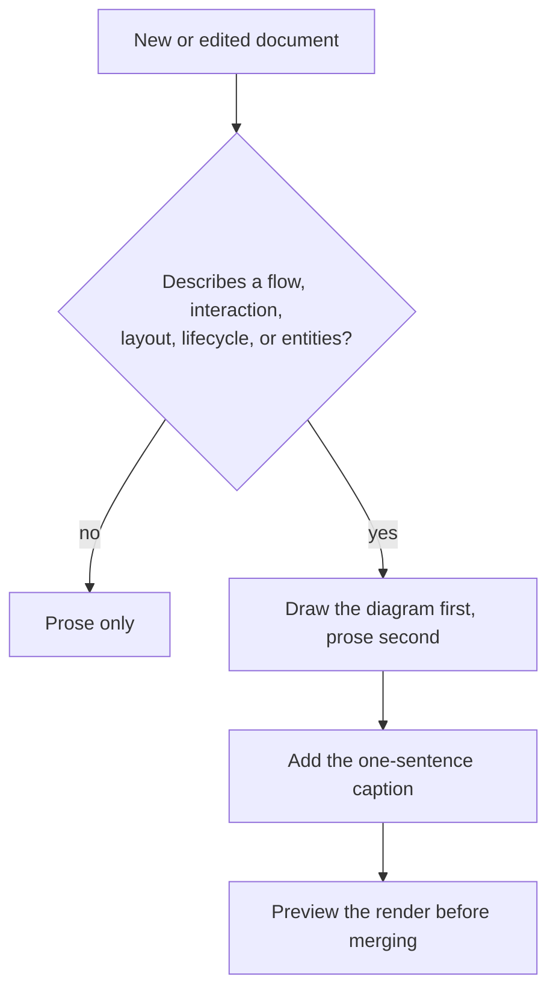

# Diagrams

When a document carries a diagram, and which format that diagram is drawn in. How it is then
written and checked is [diagrams-style.md](diagrams-style.md), which carries on this file's
rule numbering at 12 so no number means two things.

## Rules

### Mermaid is the default diagram format

1. Diagrams are authored as fenced ` ```mermaid ` blocks. Mermaid renders on every major
   code host and in the common docs-site generators, and reviews as a text diff. ASCII art,
   PNGs, and links to an external diagramming tool are not committed.
2. The exception is four layouts whose grouping and placement carry meaning — what Mermaid's
   auto-layout cannot express, having no containers and no say in where a node sits: an
   application's architecture, its tech stack, its AI agent map with the interactions and
   triggers between agents, and the cloud architecture. Those four are drawn in draw.io and
   committed under the rules below. Everything Mermaid can draw, Mermaid draws: a format
   reached for by preference rather than necessity turns every diagram into an argument.
3. Screenshots of real UI are not diagrams, and remain allowed as illustrations.

### Committing a drawn diagram

4. The export has **Include a copy of my diagram** checked, which writes the source XML into
   the SVG. The file is named `<name>.drawio.svg`, lives in the images folder the project
   already uses, and reopens in draw.io — or in an editor's draw.io extension — to re-save
   in place. One file is both picture and source: a PNG beside a separate `.drawio` is two
   artefacts nothing checks for agreement, and a stale export is invisible because the
   document still reads correctly. The markdown image carries alt text saying what the
   diagram shows.
5. The export uses **Appearance: Automatic**, with the page's adaptive colour mode (Page
   Setup) also Automatic, so `color-scheme: light dark` and `light-dark()` pairs carry both
   themes in one file. Light is the fallback below Chrome 123, Firefox 120, and Safari 17.5.
6. That tracks the **site's** theme, not the operating system's, wherever the docs-site
   theme sets a computed `color-scheme` on `<body>` — an `` inherits it, so the toggle
   in the header moves the diagram with the page. Worth verifying in a browser across all
   four combinations of OS and site theme: a theme that stopped declaring `color-scheme`
   would hand the choice back to the OS.

### When a diagram is required

The gate every document passes through, and what follows once a diagram is required:



7. A document carries at least one diagram where it describes any of: a multi-step flow, a
   request/response interaction between components, an architecture or component layout, a
   lifecycle or status machine, or relationships between stored entities.
8. A numbered list of steps involving more than one actor is a `sequenceDiagram` instead.
9. The diagram comes first and the prose second, carrying only what the diagram cannot —
   exact names, error codes, thresholds, and the reasons behind a decision.
10. One sentence saying what the diagram shows immediately precedes it. A diagram with no
    caption is an unlabelled fact, and prose that restates the diagram is the paragraph it
    replaced, back again — the caption says what the reader is looking at, not what is in
    it.

### Choosing the diagram type

| Content | Use |
|---|---|
| A process with branches or decisions | `flowchart TD` |
| Components exchanging messages over time | `sequenceDiagram` |
| Status values and the transitions between them | `stateDiagram-v2` |
| Containers, entities, and their relationships | `erDiagram` |
| Type or class hierarchies | `classDiagram` |
| An application or cloud architecture layout | a `.drawio.svg` |
| An application's tech stack | a `.drawio.svg` |
| An AI agent map, with its interactions and triggers | a `.drawio.svg` |

11. `gantt` and `timeline` are not used. Dated diagrams go stale silently.

## Rationale

Rule 7 is the point of this file. Most documents describe something moving through the
system — a message through a pipeline, a session through report generation, a user through
sign-in — and those are read far faster as a picture than as prose.
