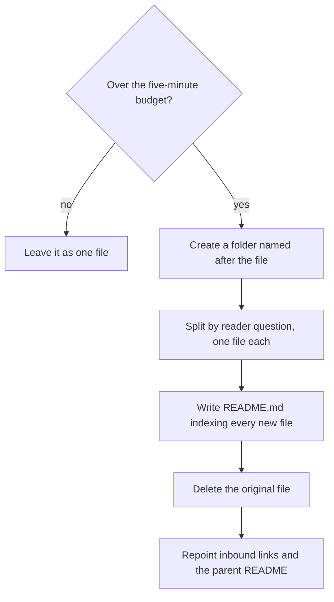

# File organization

How documents are named, how an over-budget one becomes a folder, what every folder's
`README.md` carries, and what a document file contains besides its prose.

## Rules

### Splitting an over-budget document

Splitting a document that has outgrown the budget, from the first check to the last inbound
link:



1. A document over the [sizing budget](document-sizing.md) becomes a sub-folder of smaller
   documents. The folder takes the original file's name, kebab-case, without the extension:

```text
docs/adrs/0005-host-docs-on-a-static-site.md   (1,011 words — over budget)
  →
docs/adrs/0005-host-docs-on-a-static-site/
    README.md                                  (index — replaces the original file)
    0005-host-docs-on-a-static-site-options.md
    0005-host-docs-on-a-static-site-consequences.md
```

2. The split follows the seams in the subject — **the questions a reader arrives with, asked
   one at a time**. Each resulting file answers one and meets the sizing budget on its own.
   `part-1.md` and `part-2.md` are the sign of a document halved instead, and neither half
   reads alone.
3. The original file is deleted in the same commit that adds the folder, and every inbound
   link to it is repointed. A redirect stub is not a substitute.
4. File names are lowercase kebab-case with a `.md` extension, named for the subject.
   Related documents share a filename prefix so the directory sorts into groups
   (`onboarding-overview.md`, `onboarding-email-verification.md`), and a folder-name prefix
   is kept where the folder already uses one (`docs/specs/billing/billing-invoices.md`). A
   prefix groups separate subjects; a folder holds one subject that split.
5. Folders nest no more than two levels below the documentation root.
   `docs/<application>/software-design/` is the deepest permitted; a third level means the
   area belongs at the top of the tree instead — see [tree-shape.md](tree-shape.md).

### The folder index README

6. Every folder holding markdown files holds a `README.md`. The single exception is the
   documentation root itself, where a docs-site generator may require a differently named
   home page.
7. That `README.md` lists **every** markdown file and every sub-folder in the folder, as a
   table with a one-line description each, and any non-markdown artefact the folder holds
   for a reader — a [UI test report](ui-test-reports.md) is listed the same way, and its row
   is the only navigation to it, since a docs-site generator gives a non-markdown file no
   sidebar entry. A sub-folder gets one row for the folder, not a row per file inside it —
   the folder's own index lists those:

```markdown
| Document | Covers |
|---|---|
| [Email verification](onboarding-email-verification.md) | How a new account confirms its address |
```

8. Adding, renaming, or removing a document updates the folder `README.md` in the same
   commit, and the parent folder's README gains a link to any new sub-folder in that same
   commit. An index written afterwards is written from the filenames.
9. Entries are listed in reading order — overview first, reference and detail after — not
   alphabetically. Past roughly ten rows the table takes subheadings by area; a flat list of
   thirty is a directory listing with extra steps.
10. The README indexes; it does not explain. One line per entry. Content needing more than a
    line belongs in a document the README links to.
11. `README.md` is the name a folder index takes. A code host renders it when browsing the
    folder, and the common docs-site generators treat it as the section's index page, so one
    file serves both readers.
12. A document links to a fact another document owns rather than restating it, following the
    mechanics in [cross-referencing.md](cross-referencing.md).

### Frontmatter

13. A document carries no YAML frontmatter. `version`, `date`, `authors` and `changelog` are
    all recorded by git; a hand-kept changelog rots the first time someone edits without
    updating it, and none of the agent entry points parse frontmatter, so it is noise
    wherever it is not stripped.
14. The exceptions are the facts git cannot reconstruct and the keys a build genuinely
    needs, and a document type's own constitution names them. ADRs are the standing one: a
    record carries `adr` and `status`, and `status` is what says a decision was superseded
    three years on, which no commit message puts in front of the reader. The other is a
    folder index under a docs-site generator that takes a section's sidebar label from page
    metadata — read before the page renders, where an H1 is discovered too late — which
    otherwise falls back to the prettified directory name and turns
    `docs/adrs/0001-ai-agent-framework/` into "0001 ai agent framework". A leaf document
    needs no such key, because its own label does come from its H1. A type whose
    constitution names no such field carries no frontmatter at all — a document does not
    invent its own.

```yaml
---
title: "Architecture Decision Records"
---
```

## Rationale

The folder-plus-README shape is what makes rule 1 cheap: splitting a document never breaks
navigation, because the README inherits the original file's role as the thing you land on.
Rule 8 exists because an index that drifts is worse than no index — a strict docs build
turns a stale link into a failure, but it cannot catch a file the README never mentioned.
