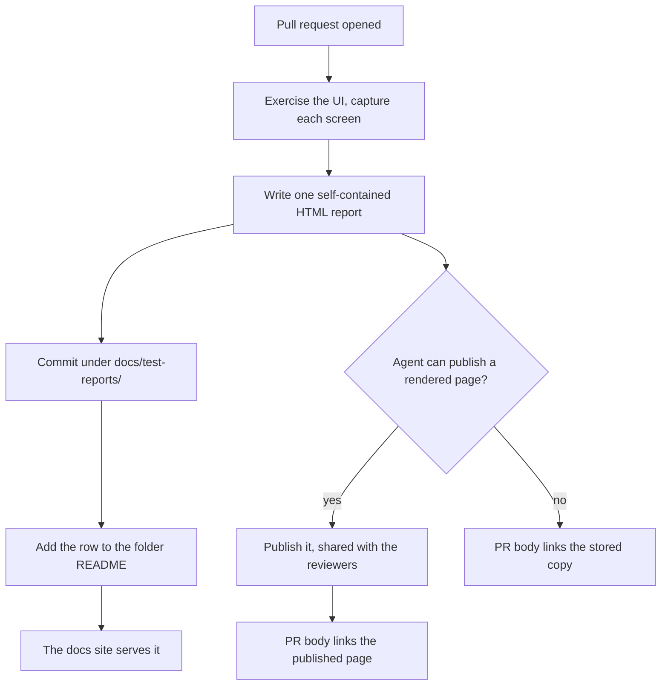

# UI test reports

What a ticket that changes a user-visible screen leaves behind as evidence: an HTML report
of the UI as it was tested, stored in the repository and linked from the pull request.

## When a report is required

A ticket that changes what a user sees — a screen, a component, a layout, an icon, a piece
of copy — produces one report. A ticket that changes only backend behaviour, configuration,
or code with no visible result produces none: a report of a screen that did not change is a
screenshot nobody compares against anything.

One report per pull request, covering every surface that PR touched. Splitting a PR's
evidence across several files leaves a reviewer guessing whether they have seen all of it.

## The path a report takes

A report is written against the open pull request, because the PR's URL is part of what it
carries:



## What a report carries

The report opens by naming the surface and the ticket, and states four things before any
screenshot: **the date the test was run** in `YYYY-MM-DD`, the ticket, **the pull request
URL**, and what was tested against — the commit, and the device, emulator, or browser. A
report whose date is the day it was written rather than the day it was run says nothing
about what the screenshots show.

Then one section per case: what was exercised, the capture, and the result. Every screenshot
carries a caption naming the screen and the state it is in; an uncaptioned capture is a
picture a reviewer has to reverse-engineer. Cases that failed stay in the report — evidence
of what does not work yet is why a reviewer reads it.

## One self-contained file

A report is a single `.html` file with its screenshots embedded as `data:` URIs and no
external references — no linked images, stylesheets, fonts, or scripts. Two reasons, and
both are hard constraints rather than preferences: a hosted preview typically serves pages
under a content-security policy that blocks images from other origins, so a report with
linked captures publishes as a page of broken frames; and keeping it to one file means the
stored copy and the published page are the same bytes, so a reviewer reading either sees the
same evidence.

Screenshots are captured at device resolution and embedded as PNG. A report that runs past
roughly 10 MB has too many captures in it, not too few — and the host's publish ceiling,
16 MB for Claude artifacts, is where it stops publishing at all.

## Where it lives

Reports live in one tree, under a folder per surface:

```text
docs/test-reports/
    README.md                                   (what a report is; links each surface)
    mobile-app/
        README.md
        2026-09-05-868-home-weekly-progress.html
    admin-console/
        README.md
        2026-09-05-826-tab-icon.html
```

The file name is the run date, the issue number, and a slug. That sorts a folder
chronologically and lets a reviewer find a ticket's evidence without opening anything. A
surface folder is created, with its own `README.md`, by the first report that needs it; the
folders nest exactly to the limit in [file-organization.md](file-organization.md), so a
report never takes a third level.

Each report is listed in its folder's `README.md` in the same commit that adds it, newest
first. That row is not decoration: it is the only navigation into a file the docs-site
generator does not put in the sidebar.

The common docs-site generators copy an `.html` file under the documentation root into the
built site unchanged, and a strict build passes on a markdown link pointing at one, so a
stored report is a real page on the docs site at its own path with no configuration. Where
the site is behind access control, that is what makes it an acceptable home for screenshots
of real screens.

## Linking it from the pull request

The PR body links the report, next to the test plan that
[board-to-pr.md](../github-projects/board-to-pr.md) already requires. A test plan says a
check passed; the report is what lets a reviewer disagree.

Where the coding agent can publish a rendered page, the report is published there and the PR
body links that instead of the stored copy — a rendered page opens in one click, where the
repository copy does not. The file is still committed: the published page is a convenience
for the review, and the repository is where the evidence stays. A published page that starts
private is shared with the reviewers as it is published; an unshared link is a 404 for
everyone but its author.

A link to the file on a raw-content host is not a substitute for either. Raw content is
served as `text/plain` with `X-Content-Type-Options: nosniff`, so the browser shows the HTML
source and, with the captures embedded, several megabytes of base64. Nothing on a code
host's own web UI renders a committed HTML file as a page.

## Rationale

The rule these all serve is that a claim about a UI is worth what its evidence is worth. A
test plan with checked boxes records that someone looked; a captioned capture beside the
ticket, the date and the commit records *what they saw*, which is the only form a reviewer
can actually disagree with. Storing it in the repository rather than only in a review
comment is the same argument [document-shape.md](document-shape.md) makes for documents:
evidence that lives outside the repository is invisible to the change that makes it wrong.
