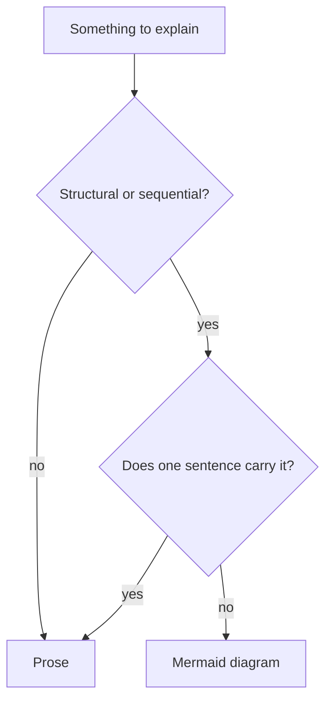

# Documents

What every document in a repository looks like, whatever kind of document it is.

Specs, ADRs, runbooks, guides, READMEs: a constitution for one kind of document adds what
is particular to it, and where that document says nothing, this one governs.

## Markdown

Documents are markdown files kept in the repository, beside what they describe. Markdown
diffs line by line, so a document is reviewed the way code is and a review comment lands on
the sentence it disputes; every code host renders it and every agent entry point reads it
without a plugin. A document kept in a wiki, a `.docx`, or a shared drive is invisible to
the change that makes it wrong, which is how it stays wrong. Where another format is the
deliverable, the markdown is the source it is generated from.

Formatting stays to what renders on the code host and in a plain viewer both: headings,
lists, tables, links, fenced code, and Mermaid. Raw HTML renders in some viewers and shows
as markup in the rest.

## Five minutes

A document is readable in five minutes — roughly a thousand words. Past that a reader
skims, and a skimmed document is one whose contents get applied from a memory of its
headings.

Running past the budget is the signal to split, not to compress. Reasons are what compress
first, and a rule stripped of its reason is the one a later reader tidies away.

One subject per file, and the title says which. A subject an existing document already
covers becomes a section in that document rather than a second file — two documents on one
subject is how a set starts contradicting itself. Related documents share a filename prefix
so the directory sorts into groups: `onboarding-overview.md`,
`onboarding-email-verification.md`.

## Splitting a subject

A subject that will not fit the budget becomes a folder named for it, holding the split
files and a `README.md` indexing only those — a prefix groups separate subjects, a folder
holds one that split:

```
docs/runbooks/
  README.md
  incident-response/
    README.md
    triage.md
    escalation.md
    postmortem.md
```

The split follows the seams in the subject — the questions a reader arrives with, asked one
at a time. `part-1.md` and `part-2.md` are the sign of a document halved instead, and
neither half reads alone.

Each file in the folder is a document like any other: one subject, five minutes, its own
opening sentence. The parent index carries a row for the folder, not for the files in it —
the folder's own index lists those.

## Diagrams

Structure and sequence are drawn rather than described. Flows, state machines, topology,
boundaries, and who calls whom go in a ` ```mermaid ` fenced block: a reader takes a diagram
in at a glance and its prose equivalent a paragraph at a time, which is most of what makes
five minutes reachable.



`accTitle` and `accDescr` are part of the diagram, as above: the rendered SVG tells a
screen reader nothing, and the description is what every reader gets on the day the block
fails to render. The prose beside a diagram does not restate it — a caption listing a
diagram's own contents is the paragraph it replaced, back again.

## Shape

An H1 naming the subject opens the file, and one sentence under it says what the document
covers — a reader who opened the wrong file finds that out in the first line.

The headings below come from the subject rather than from a template; Overview / Details /
Conclusion imposed on a short document is three headings and no content. A document type
whose constitution fixes its sections instead has readers who compare across files — an
ADR's Options section is in the same place in every record.

## Files

Lowercase kebab-case with a `.md` extension, named for the subject.

No YAML frontmatter, with named exceptions. No `version`, `date`, `authors`, or
`changelog`: git records all four, a hand-kept changelog rots the first time someone edits
without updating it, and none of the agent entry points parse frontmatter, so it is noise
wherever it is not stripped.

The exceptions are the facts git cannot reconstruct, and a document type's own constitution
names them. ADRs are the standing one: a record carries `adr: NNNN` and `status`, and
`status` is what says a decision was superseded three years on, which no commit message
puts in front of the reader. A type whose constitution names no such field carries no
frontmatter at all — a document does not invent its own.

## The index

Every directory of documents carries a `README.md` indexing it: a link, and one line on
what each covers, so a reader arriving at the directory gets a map rather than a listing.

```markdown
| Document | Covers |
|---|---|
| [Email verification](onboarding-email-verification.md) | How a new account confirms its address |
```

A row lands in the change that adds, renames, or removes the document rather than
afterwards — an index written later is written from the filenames. Past roughly ten rows
the table takes subheadings by area; a flat list of thirty is a directory listing with
extra steps.

## Kept true

A document is edited in the change that makes it wrong, and deleted in the change that
removes what it described. Git keeps the history, so a deleted document costs a reader
nothing — while a stale one costs them what they were willing to believe about the
documents next to it.

A record of something that happened is the exception, and is marked rather than removed: an
ADR whose decision was reversed still describes the choice that was made, which is what the
reader came for.
