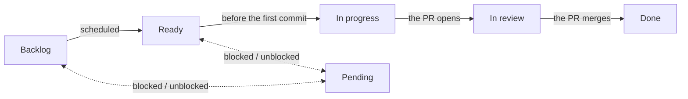
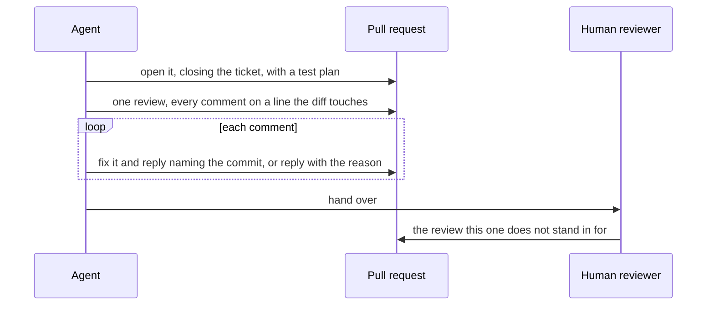

# From board to reviewed PR

What happens to a ticket between the board and a pull request ready for a human, and the
board mechanics that are easy to get wrong.

## Branch, commits, PR

One branch per ticket, and one pull request from it. The branch name contains
`<issue-number>-<short-slug>`. A tooling-applied prefix is accepted — worktree tooling emits
`worktree-820-empty-greeting-balloon`, and a type prefix such as
`docs/834-authoring-convention` is equally fine — because a rule the default tooling breaks
on every use is not a rule. What the name carries is the issue number and a slug that reads.

Commits reference their ticket with `Refs #<number>` rather than a closing keyword: the
ticket is finished when the PR merges, not when a commit lands on the branch.

A branch that passes the size limit in [Writing tickets](tickets.md) stops and splits,
before its PR opens or after. The work so far that stands alone becomes this ticket's PR,
trimmed to it, and the ticket body is corrected to match; the rest becomes new tickets,
registered in the intake column with their dependencies on this one and cut along the seams
in [Splitting a ticket](tickets-splitting.md). A PR does not open over the limit with an
explanation in its description instead, since that explanation is the exception a ticket
cannot grant itself.

The PR body closes the ticket (`Closes #<number>`), gives the diff's file count and names
any file left out of it as generated or a UI test report, summarises what changed, and
carries a test plan whose boxes are checked as each check actually passes — an unchecked box
is worth more than a checked one nobody ran.

Where the PR changes a user-visible screen, a link to that run's UI test report sits beside
the test plan; see the documentation constitution's
[UI test reports](../documentation/ui-test-reports.md) for what the report carries and which
of its two links belongs in the body.

Pull requests are not added to the board by hand: whether they belong on it is set by the
project's own auto-add workflows, and inserting one overrides a decision already made.

## Status

*Pending*, or whatever a board names its blocked column, sits off that path and holds
nothing merely un-triaged. It is where a ticket waits when something outside it is in the
way, and it leaves for the column it came from once that clears.

The board is written while the work happens, not reconstructed afterwards. The ticket moves
to *In progress* before its first commit and to *In review* when the PR opens.

`gh project item-edit` reports success without changing anything when the ID it is handed
is stale or belongs to another board, so the row is re-read before the ticket moves to
*In review*. A ticket whose row still reads *Backlog* while its PR is open is what a status
write that went nowhere looks like.

Self-review and everything it produces happen on that same open PR and move nothing
further: *In review* is already true. The ticket's *Done* belongs to the merge — `Closes`
shuts the issue, and a board running the closed-item workflow moves the row itself.

## Self-review

A PR gets one honest pass over its own diff before a human is asked for one, and the pass
checks the file count before anything else. The review's summary states that count; a
count over the limit is fixed by splitting, not answered with a reply, because no reply
makes a diff smaller. The findings go up as a single review of inline comments, each
anchored to a line the diff actually touches — a comment aimed anywhere else is rejected —
so the fixes that follow read as a thread a later reviewer can retrace.

Every comment gets a reply: the ones acted on name the commit that fixed them, the ones
left alone give the reason. A finding quietly fixed leaves the next reader diffing against
a comment that no longer matches the code; one quietly dropped is indistinguishable from
one that was missed. The pass is a first pass, and does not stand in for the human review.

A review of one's own PR is submitted as `COMMENT`. GitHub rejects `REQUEST_CHANGES` on your
own pull request with a 422.

## Driving the board with `gh`

- Board mutations need the `project` OAuth scope, which `gh auth login` does not grant;
  `gh auth refresh -s project` adds it. The check belongs before the first status change,
  not three commits in.
- A user-scoped board needs `--owner <user>` on every `gh project` call, or `gh` guesses
  the scope and guesses wrong. The owner and number to pass are in the project's agent
  entry point.
- Field and option IDs are opaque and per-board, and option names differ — *In progress* on
  one board is *In Progress* on the next. Both are resolved per run, matched
  case-insensitively, rather than pasted from a previous session.
- `gh project item-list` caps at 400 items. Past that a status no longer appears in a
  listing that still looks complete; page the GraphQL `items` connection instead when the
  answer has to cover the whole board.
- Issue dependencies — the prerequisites [Writing tickets](tickets.md) requires registering —
  are **REST, not GraphQL**: `repos/{owner}/{repo}/issues/{n}/dependencies/blocked_by`, with
  `blocking` as the reverse read. They belong to the issue rather than to the board, so no
  `gh project` call reaches them.
- `issue_id` in that POST is the blocker's **numeric database id**
  (`gh api repos/{owner}/{repo}/issues/{n} --jq .id`) — never the issue number, and never the
  `I_kwDO…` node id. It is passed with `-F`, not `-f`: the field is typed integer and a
  string is a 422.
- That POST answers with the issue it was called on rather than the blocker, so its response
  looks identical whether or not the link was made. The relationship is confirmed by
  re-reading `blocked_by`.
