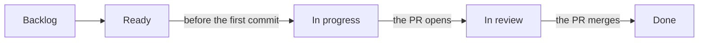
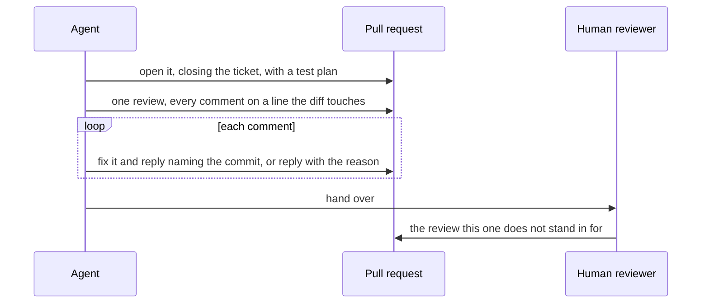

# From board to reviewed PR

What happens to a ticket between the board and a pull request ready for a human, and the
board mechanics that are easy to get wrong.

## Branch, commits, PR

One branch per ticket, named `<issue-number>-<short-slug>`, and one pull request from it.

Commits reference their sub-item with `Refs #<number>` rather than a closing keyword: a
sub-item is finished when the PR merges, not when its commit lands on the branch. A
checkbox sub-item has no number of its own, so its commits reference the parent ticket
instead.

The PR body closes the ticket (`Closes #<number>`), summarises what changed, and carries a
test plan whose boxes are checked as each check actually passes — an unchecked box is worth
more than a checked one nobody ran.

Pull requests are not added to the board by hand: whether they belong on it is set by the
project's own auto-add workflows, and inserting one overrides a decision already made.

## Status

The board is written while the work happens, not reconstructed afterwards. The ticket moves
to *In progress* before its first commit and to *In review* when the PR opens. A sub-item
with a board row of its own moves to *Done* as its commit lands; a checkbox sub-item has no
row and no status.

`gh project item-edit` reports success without changing anything when the ID it is handed
is stale or belongs to another board, so the rows are re-read before the ticket moves to
*In review*. A ticket *In review* above sub-items still reading *Backlog* is what a status
write that went nowhere looks like.

Self-review and everything it produces happen on that same open PR and move nothing
further: *In review* is already true. The ticket's *Done* belongs to the merge — `Closes`
shuts the issue, and a board running the closed-item workflow moves the row itself.

## Self-review

A PR gets one honest pass over its own diff before a human is asked for one. The findings
go up as a single review of inline comments, each anchored to a line the diff actually
touches — a comment aimed anywhere else is rejected — so the fixes that follow read as a
thread a later reviewer can retrace.

Every comment gets a reply: the ones acted on name the commit that fixed them, the ones
left alone give the reason. A finding quietly fixed leaves the next reader diffing against
a comment that no longer matches the code; one quietly dropped is indistinguishable from
one that was missed. The pass is a first pass, and does not stand in for the human review.

## Driving the board with `gh`

- Board mutations need the `project` OAuth scope, which `gh auth login` does not grant;
  `gh auth refresh -s project` adds it. The check belongs before the first status change,
  not three commits in.
- A user-scoped board needs `--owner <user>` on every `gh project` call, or `gh` guesses
  the scope and guesses wrong. The owner and number to pass are in the project's agent
  entry point.
- A sub-issue missing from `gh project item-list` is unenrolled, not absent — a board
  without the sub-issue auto-add workflow does not enrol a child because its parent is on
  it. Enrol it, then take the item ID from the mutation's response; reading the empty row
  as "no item ID exists" is what produced two bug-fix commits here.
- Field and option IDs are opaque and per-board, and option names differ — *In progress* on
  one board is *In Progress* on the next. Both are resolved per run, matched
  case-insensitively.
