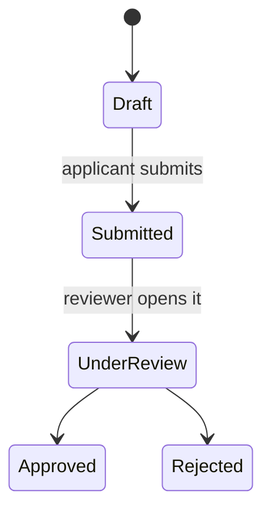

# Product specs

What a specification says about a product, and what it leaves to the code.

The readers are product managers, designers, and business stakeholders. Plain language, no
engineering vocabulary — a sentence that needs a reader who knows the stack belongs
somewhere other than a spec.

## Behaviour, not implementation

Every sentence answers *what does it do?* or *why does it do that?*, never *how is it
built?* No languages, frameworks, cloud services, databases, or infrastructure: naming them
makes the spec wrong the day the implementation moves underneath it, and wrong in a way
nobody notices until they trust it.

> Users receive an email notification when their application status changes.

not

> A Lambda function triggers an SES call when the applications table is updated.

The second is not a rougher description of the same thing. It describes something else —
something the intended reader can neither confirm nor dispute.

## Files

Specs live in `docs/specs/`, lowercase kebab-case, and carry no YAML frontmatter — no
version, date, or changelog, because git records all three and a changelog kept by hand
rots the first time someone edits without updating it. Related specs share a filename
prefix so the directory sorts into groups: `onboarding-overview.md`,
`onboarding-email-verification.md`.

One concern per file — a file answers one clear question — and about 400–600 words, a
three-minute read. Running past the budget is the signal to split rather than to compress;
a spec that outgrows it is usually holding two concerns. A concern an existing spec already
covers becomes a section in that spec rather than a second file, for the same reason:
two specs on one concern start contradicting each other.

## Diagrams

Anything structural or sequential — user flows, state transitions, how screens relate — is
a Mermaid diagram in a fenced block wherever the alternative is a paragraph of dense prose.
A two-step sequence that a sentence handles cleanly stays a sentence; a branching flow
described in prose is where readers stop reading.



## Shape

No fixed section list. A short spec that reads as prose beats the same content pushed into
Overview / Behaviour / Edge Cases, and the headings a spec does grow come from its subject.
Edge cases are part of the behaviour, not an appendix to it:

```markdown
# Email verification

A new account is unverified until the person confirms the address they signed up with.

Signing up sends a verification link to that address. Following it marks the account
verified and clears the reminder banner.

An unverified account can browse and search, but cannot post, comment, or be mentioned
by another user — the restriction is what makes verification worth doing.

The link expires after 24 hours. Requesting a new one invalidates the previous link, so
a forwarded email cannot verify an account a second time.
```

## The index

`docs/specs/README.md` carries a table: one row per spec, linked, with a line on what it
covers. It is updated in the change that adds, renames, or removes a spec, not afterwards.
Past roughly six specs the table takes subheadings by area — a flat list of twenty is a
directory listing with extra steps.
